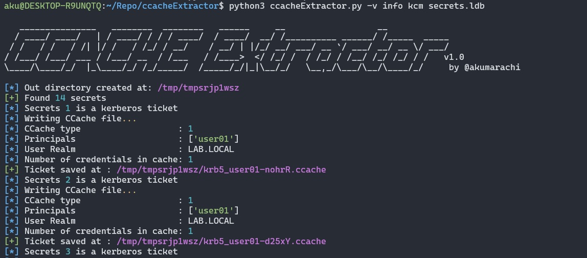

# ccacheExtractor
<p align="center">
    A python script to automatically dump all kerberos secrets stored into KCM ldb
<br>
<br>
</p>

## Abstract
On Linux systems, Kerberos tickets can be stored in different way including within a .ldb database file.

The database contains all tickets used on the system and is only readable by root. 
This tool aims to retrieve all the tickets present in it.

-> This is the default configuration using sssd. 

## Usage
```bash
python3 -m pip install -r requirements.txt
python3 ccacheExtractor.py [-h] [-v VERBOSITY] [-o OUTDIR] kcm secrets.ldb
```



## Contributing

Pull requests are welcome. Feel free to open an issue if you want to add other features.